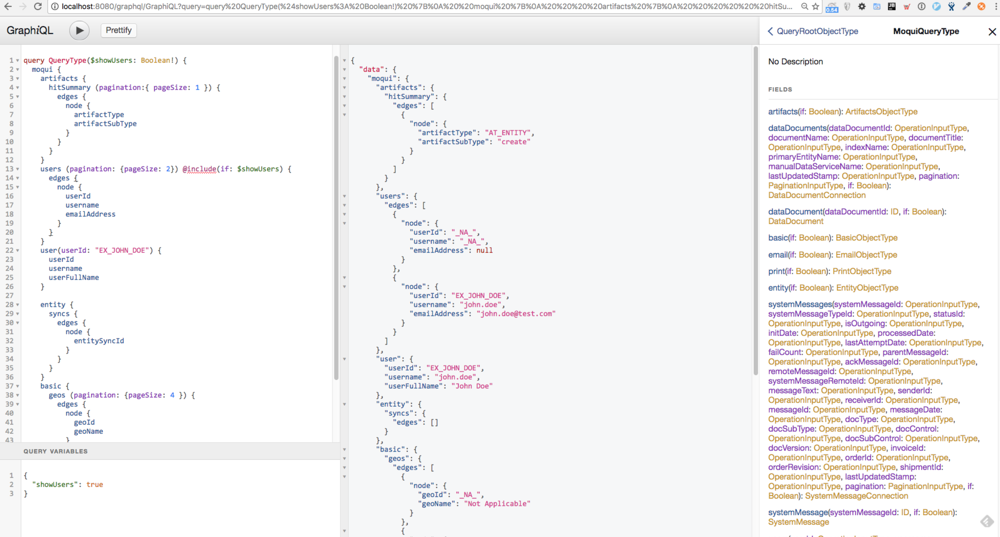

# This is a demo for [Moqui GraphQl](https://github.com/shendepu/moqui-graphql) 

This demo depends on:
- [Moqui Framework](https://github.com/moqui/moqui-framework)
- [Moqui Runtime](https://github.com/moqui/moqui-runtime)
- [Moqui GraphQL](https://github.com/shendepu/moqui-graphql)
 
## tl;dr

```sh
git clone https://github.com/moqui/moqui-framework

cd moqui-framework
./gradlew getRuntime

git clone https://github.com/shendepu/moqui-graphql ./runtime/component/moqui-graphql
git clone https://github.com/shendepu/moqui-graphql-demo ./runtime/component/mqoui-graphql-demo
 
./gradlew run 
```

First open http://localhost:8080 and login with john.deo test account

then open [http://localhost:8080/graphql/GraphiQL?schemaName=graphql-demo](http://localhost:8080/graphql/GraphiQL?schemaName=graphql-demo)

input 
```graphql
{
  graphqlDemo {
    basic {
      enums {
        enumId
        enumTypeId
        description
        lastUpdatedStamp
      }
    }
  }
}
```
result would be like 
```json
{
  "data": {
    "graphqlDemo": {
      "basic": {
        "enums": [
          {
            "enumId": "DST_PURCHASED_DATA",
            "enumTypeId": "DataSourceType",
            "description": "Purchased Data",
            "lastUpdatedStamp": 1474531992194
          },
          {
            "enumId": "DST_CUSTOMER_ENTRY",
            "enumTypeId": "DataSourceType",
            "description": "Customer Data Entry",
            "lastUpdatedStamp": 1474531992194
          },
          {
            "enumId": "DST_INTERNAL_ENTRY",
            "enumTypeId": "DataSourceType",
            "description": "Internal Data Entry (employees, etc)",
            "lastUpdatedStamp": 1474531992194
          },
          {
            "enumId": "DST_MAILING_SIGNUP",
            "enumTypeId": "DataSourceType",
            "description": "Mailing List Sign-up",
            "lastUpdatedStamp": 1474531992194
          },
          {
            "enumId": "_NA_",
            "enumTypeId": "_NA_",
            "description": "Not Applicable",
            "lastUpdatedStamp": 1474531992194
          }
        ]
      }
    }
  }
}
```

You may modify the query by removing some fields of enums to get different result  

## Snapshot


